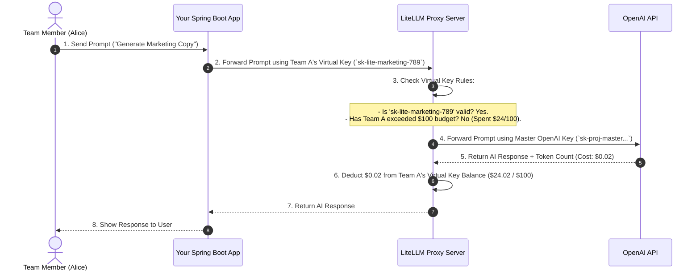

# LiteLLM Proxy API Key Management Guide

---

## 💡 Executive Summary

When using **Option 1: LiteLLM Proxy**, your end users and team members **DO NOT need to create or bring their own OpenAI / Claude API keys!**

Instead, the system uses a **Master Key vs. Virtual Keys** concept:
1. **Your Company** holds **ONE Master API Key** (e.g., your company's official OpenAI account).
2. **LiteLLM Proxy** generates lightweight **Virtual API Keys** for each Team or User, attached to budget limits and tracking rules.

---

## 🔑 Master Key vs. Virtual Keys Explained

```
┌────────────────────────────────────────────────────────────────────────┐
│                        1. MASTER API KEY                               │
│  (Owned by Your Company - Stored securely inside LiteLLM Server)       │
│   e.g. OPENAI_API_KEY = "sk-proj-company-master-key-xyz"              │
└──────────────────────────────────┬─────────────────────────────────────┘
                                   │
                                   ▼
┌────────────────────────────────────────────────────────────────────────┐
│                        2. LITELLM PROXY SERVER                         │
│  (Acts as the cashier & budget controller)                             │
└──────────┬───────────────────────┼───────────────────────┬─────────────┘
           │                       │                       │
           ▼                       ▼                       ▼
┌─────────────────────┐ ┌─────────────────────┐ ┌─────────────────────┐
│ Virtual Key: Team A │ │ Virtual Key: Team B │ │ Virtual Key: User C │
│ `sk-litellm-teamA`  │ │ `sk-litellm-teamB`  │ │ `sk-litellm-userC`  │
│ Budget: $100/month  │ │ Budget: $500/month  │ │ Budget: $20/month   │
└─────────────────────┘ └─────────────────────┘ └─────────────────────┘
```

---

## ❓ Question 1: Do users need to create API keys themselves?

### **NO! Absolutely Not.**
- Users **never** log into OpenAI, Anthropic, or Google.
- Users **never** enter credit card details or manage AI provider accounts.
- Your company manages the single central AI provider account (OpenAI). LiteLLM distributes access via virtual sub-keys.

---

## ❓ Question 2: How do we get / generate Virtual API Keys for Teams?

There are **2 Simple Ways** to issue virtual keys:

### Way A: Manually via the LiteLLM Admin Web UI (Zero Code)
1. Open the LiteLLM Admin UI in your browser (`http://localhost:4000/ui`).
2. Click **"Create New Key"**.
3. Fill in the parameters:
   - **Key Name / Alias**: `Marketing Team`
   - **Max Budget**: `$100.00`
   - **Reset Period**: `Monthly`
   - **Allowed Models**: `gpt-4o`, `gpt-4o-mini`
4. Click **Generate** $\rightarrow$ Copy the virtual key (e.g., `sk-lite-marketing-789`).

---

### Way B: Automatically via REST API from your Spring Boot App (Automated)

When a new team registers in your app, your Spring Boot backend sends a single `POST` request to LiteLLM to generate their key automatically:

#### Request (Spring Boot $\rightarrow$ LiteLLM):
```http
POST http://litellm-proxy:4000/key/generate
Authorization: Bearer <LITELLM_MASTER_KEY>
Content-Type: application/json

{
  "key_alias": "Marketing_Team_Key",
  "team_id": "team_marketing_456",
  "max_budget": 100.00,
  "budget_duration": "30d",
  "models": ["gpt-4o", "gpt-4o-mini"],
  "metadata": {
    "created_by": "Spring Boot App"
  }
}
```

#### Response (LiteLLM $\rightarrow$ Spring Boot):
```json
{
  "key": "sk-lite-8a7f9b2c3d4e5f6g",
  "max_budget": 100.0,
  "team_id": "team_marketing_456",
  "expires": null
}
```

Your Spring Boot app saves `sk-lite-8a7f9b2c3d4e5f6g` in your database under `Team Marketing`.

---

## 🔄 Complete End-to-End Request Flow

Here is how a request works once the Virtual Key is created:



---

## 🎯 Summary of Key Benefits

1. **Zero Effort for Users**: Users just use your web application normally.
2. **Centralized Billing**: Your company pays 1 bill to OpenAI.
3. **Instant Key Revocation**: If a team member leaves, you can delete or freeze their Virtual Key in 1 click without affecting anyone else.
4. **Hard Budget Safety**: If Team A hits their \$100 budget limit, LiteLLM automatically blocks only Team A while other teams keep working fine.
