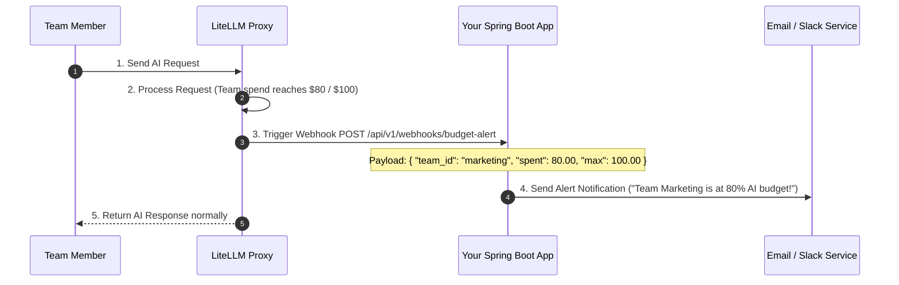

# Complete Guide: Tracking AI Usage + Budget Management with LiteLLM Proxy

---

## 💡 Executive Summary

**LiteLLM Proxy handles Usage Tracking and Budget Management together automatically out of the box.** You do not need to write custom tracking code or database calculation scripts.

When a team member sends an AI request, LiteLLM simultaneously:
1. **Tracks Usage**: Counts prompt tokens, output tokens, request counts, response latency, and model name.
2. **Calculates Spend**: Translates tokens into real USD cost based on official model pricing (e.g. GPT-4o input/output rates).
3. **Enforces Budgets**: Deducts the cost from the team's assigned budget (e.g. \$100/month) and automatically blocks requests if the budget limit is reached.

---

## 📊 1. What Usage & Budget Data Is Tracked?

| Category | Tracked Metrics | Example Data |
| :--- | :--- | :--- |
| **Token Usage** | Prompt Tokens, Output Tokens, Total Tokens | 150 prompt + 300 output = 450 total tokens |
| **Financial Spend** | Cost per Request, Total Daily Spend, Monthly Accumulation | \$0.003375 for Request #123 $\rightarrow$ \$42.50 spent this month |
| **Budget Controls** | Max Budget Limit, Remaining Budget, Reset Period | Max: \$100.00, Spent: \$42.50, **Remaining: \$57.50** (Resets monthly) |
| **Performance** | Latency (Time to First Token, Total Response Time) | Latency: 420 ms |
| **Identity & Audit** | Team ID, User ID, Virtual Key Alias, Model Requested | Team: `Marketing`, User: `Alice`, Model: `gpt-4o` |

---

## ⚙️ 2. How Budget Management Works (Hard & Soft Limits)

LiteLLM supports two types of budget controls for each Team or Virtual Key:

```
$0.00 Spent                                   $80.00 (Soft Limit)               $100.00 (Hard Limit)
 [================================─────────────────|──────────────────────────────────|]
                                            🔔 Send Slack/Email Alert       ⛔ Block Requests (Error 429)
                                             "Team at 80% Budget"            "Budget Limit Reached"
```

1. **Soft Budget (Alert Threshold)**:
   - Example: \$80.00 on a \$100.00 budget.
   - Action: When reached, LiteLLM sends a Webhook notification to Slack/Email or your Spring Boot app saying: *"Warning: Team Marketing has used 80% of their monthly AI budget!"*
   - Requests are **still allowed** to proceed normally.

2. **Hard Budget (Enforcement Limit)**:
   - Example: \$100.00 maximum budget.
   - Action: When reached, LiteLLM instantly blocks all subsequent requests from that Team/Key with an HTTP `429 Too Many Requests` error (`"Budget Exceeded for Team Marketing"`).

3. **Auto-Reset Duration**:
   - You can configure budgets to automatically reset every `1d` (daily), `7d` (weekly), `30d` (monthly), or set a fixed `total_budget` (one-time prepaid limit).

---

## 🛠️ 3. How to Set Up Teams & Budgets (2 Ways)

### Way A: Using LiteLLM Admin UI (No Code)
1. Open LiteLLM Admin UI in your browser (`http://localhost:4000/ui`).
2. Go to **Teams** $\rightarrow$ Click **"Create New Team"**.
3. Set the Team details:
   - **Team Name**: `Engineering Team`
   - **Max Budget**: `$500.00`
   - **Budget Duration**: `30d` (Resets every 30 days)
   - **Models Allowed**: `gpt-4o`, `claude-3-5-sonnet`
4. Click Save. Every virtual key generated under this team shares this \$500 budget!

---

### Way B: Via REST API from your Spring Boot Backend (Automated)

#### Step 1: Create a Team with a Budget
```http
POST http://litellm-proxy:4000/team/new
Authorization: Bearer <LITELLM_MASTER_KEY>
Content-Type: application/json

{
  "team_alias": "Marketing_Team",
  "max_budget": 100.00,
  "budget_duration": "30d",
  "models": ["gpt-4o", "gpt-4o-mini"]
}
```

#### Step 2: Generate a Virtual Key for Team Member (Alice)
```http
POST http://litellm-proxy:4000/key/generate
Authorization: Bearer <LITELLM_MASTER_KEY>
Content-Type: application/json

{
  "team_id": "team_marketing_123",
  "user_id": "user_alice_456",
  "key_alias": "Alice_Marketing_Key"
}
```

---

## 📈 4. How to Retrieve Usage & Budget Reports

You can view usage & budget statistics in **3 convenient ways**:

### Method 1: The Built-in LiteLLM Dashboard UI
LiteLLM provides interactive visual charts, progress bars, and cost breakdowns out of the box:
- Visual bar charts showing daily spend per team.
- Leaderboard of highest-consuming team members.
- Real-time remaining budget progress bars.

### Method 2: Calling LiteLLM Information REST APIs
Your Spring Boot app can fetch real-time budget status to show on your internal frontend:

```http
GET http://litellm-proxy:4000/team/info?team_id=team_marketing_123
Authorization: Bearer <LITELLM_MASTER_KEY>
```

**JSON Response returned to Spring Boot**:
```json
{
  "team_id": "team_marketing_123",
  "team_alias": "Marketing_Team",
  "max_budget": 100.00,
  "spend": 42.50,
  "remaining_budget": 57.50,
  "budget_duration": "30d",
  "members": [
    { "user_id": "user_alice_456", "user_spend": 28.10 },
    { "user_id": "user_bob_789", "user_spend": 14.40 }
  ]
}
```

### Method 3: Direct Database Query (LiteLLM Postgres Table)
LiteLLM automatically logs every request into a PostgreSQL table named `LiteLLM_SpendLogs`. If you want custom SQL analytics:

```sql
-- Get total spend and token count for Team Marketing today
SELECT 
    team_id,
    user_id,
    SUM(spend) AS total_spend_usd,
    SUM(total_tokens) AS total_tokens_used,
    COUNT(request_id) AS total_requests
FROM LiteLLM_SpendLogs
WHERE team_id = 'team_marketing_123'
  AND startTime >= CURRENT_DATE
GROUP BY team_id, user_id;
```

---

## 🔔 5. Budget Alert Webhook Flow (Spring Boot Integration)

When a team approaches their budget limit, LiteLLM can automatically notify your Spring Boot application via a Webhook:



---

## ✅ Summary

With **LiteLLM Proxy**:
1. **Usage Tracking** (Tokens, Cost, Latency, User ID, Team ID) happens automatically for every request.
2. **Budget Management** (Setting \$ caps, auto-resets, soft alerts, hard blocking) is completely handled by LiteLLM.
3. **No Custom Infrastructure Needed**: You don't need to build custom Redis counters, tracking filters, or scheduling workers!
