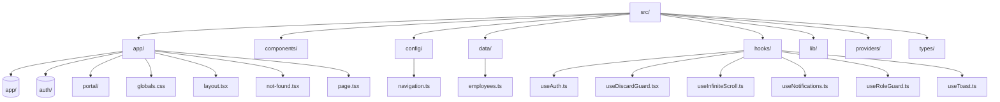

# Project Directory Structure

```
src/
├── app/
│   ├── (app)/
│   ├── (auth)/
│   ├── portal/
│   ├── globals.css
│   ├── layout.tsx
│   ├── not-found.tsx
│   └── page.tsx
├── components/
├── config/
│   └── navigation.ts
├── data/
│   └── employees.ts
├── hooks/
│   ├── useAuth.ts
│   ├── useDiscardGuard.tsx
│   ├── useInfiniteScroll.ts
│   ├── useNotifications.ts
│   ├── useRoleGuard.ts
│   └── useToast.ts
├── lib/
├── providers/
└── types/
```

## Mermaid Diagram


